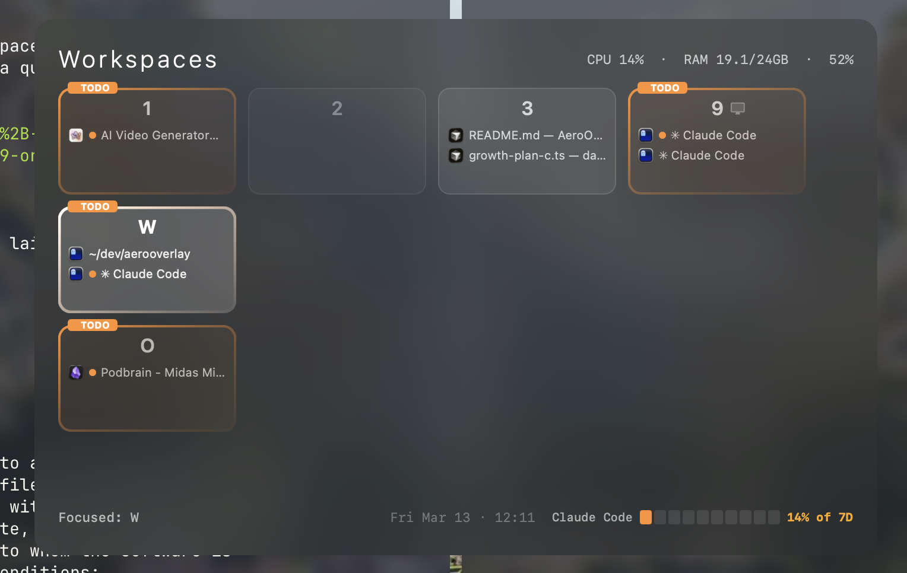

# AeroOverlay

A floating workspace overview panel for [AeroSpace](https://github.com/nikitabobko/AeroSpace) on macOS. Double-tap Option to get a quick glance at all your workspaces, their windows, and system stats.




## Features

- **Workspace grid** — shows active workspaces laid out to mirror keyboard positions (1-9, q-y, a-f, o)
- **Window list** — each workspace cell shows app icons and window titles
- **Double-tap Option** — open the overlay; single tap to dismiss
- **SIGUSR1 toggle** — also toggleable via signal for external scripts
- **Claude Code usage** — displays your 7-day usage bar in the footer
- **System stats** — CPU, RAM, and battery in the header
- **Notifications** — highlights workspaces where Claude Code finished a task, with per-window identification
- **External monitor indicator** — display icon on workspaces assigned to external monitors
- **Keyboard navigation** — arrow keys + Enter to switch workspaces
- **Click to switch** — click any workspace cell to focus it

## Requirements

- macOS 13+
- [AeroSpace](https://github.com/nikitabobko/AeroSpace) window manager
- Accessibility permissions (for global hotkey)

## Build & Install

```bash
swift build -c release
cp .build/release/AeroOverlay ~/.local/bin/
```

### Grant Accessibility

System Settings > Privacy & Security > Accessibility > add `~/.local/bin/AeroOverlay` and toggle on.

## Usage

```bash
# Launch
AeroOverlay &

# Or use the toggle script (launches if not running)
scripts/aero-overlay-toggle
```

**Double-tap Option** to open, **single tap Option** to close. Press **Escape** or click outside to dismiss.

## Claude Code Notifications

AeroOverlay can highlight workspaces where Claude Code is waiting for input. Add the notify script to your Claude Code hooks (`~/.claude/settings.json`):

```json
{
  "hooks": {
    "Notification": [
      {
        "hooks": [
          {
            "type": "command",
            "command": "/path/to/aero-overlay-notify"
          }
        ]
      }
    ],
    "Stop": [
      {
        "hooks": [
          {
            "type": "command",
            "command": "/path/to/aero-overlay-notify"
          }
        ]
      }
    ]
  }
}
```

The notify script is at `scripts/aero-overlay-notify` (also installed to `~/.local/bin/aero-overlay-notify`).

Notifications clear automatically when you select the workspace in the overlay.

## Scripts

| Script | Description |
|--------|-------------|
| `scripts/aero-overlay-toggle` | Toggle overlay visibility, launching if not running |
| `scripts/karabiner-rule.json` | Karabiner-Elements rule for double-tap Option (alternative to built-in hotkey) |

## License

MIT — see [LICENSE](LICENSE).
